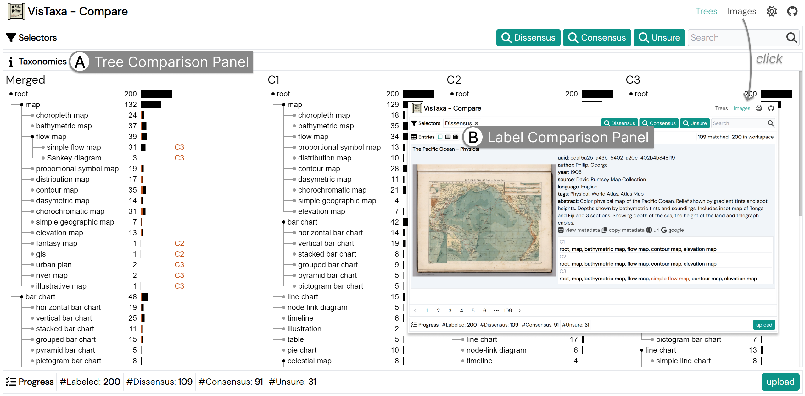

# Taxonomy Comparison Interface



The `taxonomy comparison interface` of OldVis image taxonomy labeler.

The user can compare the taxonomy labels (exported from the `taxonomy labeling interface`) of multiple annotators.

The code in this subdirectory is initialized with the [Vitesse-lite template](https://github.com/antfu/vitesse-lite).

## How to Use

Before launching the client, make sure you have [node.js](https://nodejs.org/) and [pnpm](https://pnpm.io/) installed.

To launch the server, you need to:

```bash
pnpm install
pnpm run dev
```

If you see your browser automatically opening the page `http://localhost:3333/`, the client is successfully launched 🚀.

The annotations to be compared can be exported from the [taxonomy labeling interface](../client-label/).

The annotations to be compared can be obtained from [2025.VisTaxa.coding](https://github.com/zhangyu94/2025.VisTaxa.coding).

## Features

- **Highlight** image overlap
    - semantics: highlight the proportion of overlapping images
    - interaction: hovering over the node or bar corresponding to a taxon
    - effect: creates an overlaying bar for all annotators' all taxa with overlapping images, with the bar's width proportional to the number of overlapping images
- **Filter** images by a taxon
    - semantics: show the images belonging to a taxon $c$ in the merged tree
    - interaction: click on the node or bar corresponding to a taxon
