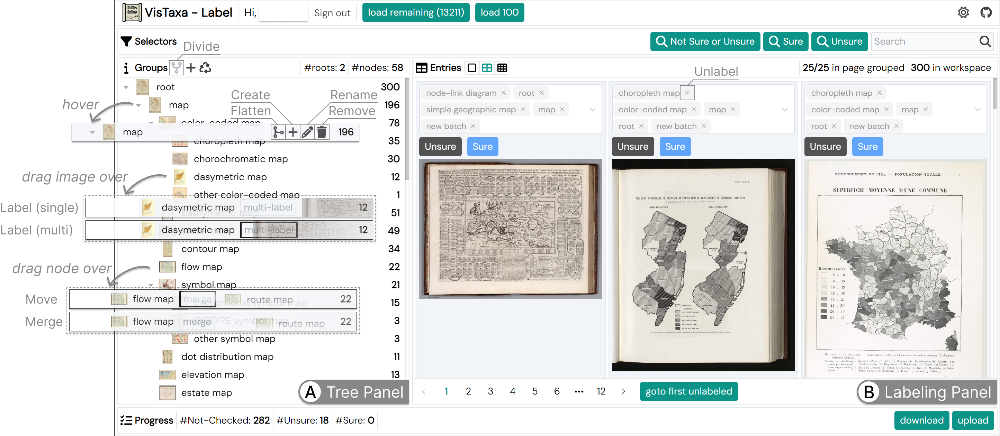

# Taxonomy Labeling Interface



The `taxonomy labeling interface` of OldVis image taxonomy labeler ([live demo](https://oldvis.github.io/image-taxonomy-labeler/)).

The user can assign hierarchical classification labels, such as `vis -> bar chart -> stacked bar chart`, to a visualization image.

The code in this subdirectory is initialized with the [Vitesse-lite template](https://github.com/antfu/vitesse-lite).

## How to Use

Before launching the client, make sure you have [node.js](https://nodejs.org/) and [pnpm](https://pnpm.io/) installed.

To launch the server, you need to:

```bash
pnpm install
pnpm run dev
```

If you see your browser automatically opening the page `http://localhost:3333/`, the client is successfully launched 🚀.

## Features

The following features are implemented in `./src/builtins/labelTasks/taxonomization/useOperators.ts`:

- Editing the taxonomic hierarchy
    - **Create** a taxon
        - semantics: create a taxon $c$
        - topology: append a node $c$ to a node $c'$ in the forest
            - If $c$ is the only child of $c'$, append an additional `ungrouped` node to $c'$
        - image label:
            - If $c$ is not the only child of $c'$, no change.
            - If $c$ is the only child of $c'$, assign the images labeled $c'$ to `ungrouped`.
        - interaction: click on the `+` button
    - **Divide** a taxon
        - semantics: create subtaxa $c_1$, $c_2$, ..., $c_n$ for taxon $c$ by clustering
        - topology: append nodes $c_1$, $c_2$, ..., $c_n$ to node $c'$ in the forest
        - image label: assign the images labeled $c'$ to one of the label categories $c_1$, $c_2$, ..., $c_n$
        - interaction: click on the fork button
    - **Flatten** a taxon
        - semantics: remove subtaxa $c_1$, $c_2$, ..., $c_n$ of taxon $c$
        - topology: remove the children nodes $c_1$, $c_2$, ..., $c_n$ of node $c$ in the forest
        - image label: unassign images to the removed label categories $c_1$, $c_2$, ..., $c_n$
        - interaction: click on the merge button
        - remark: can be used to undo a divide operation
    - **Merge** two taxa
        - semantics: merge two taxa $c_1$ and $c_2$ into a single taxon $c_1$
        - topology: remove node $c_2$ and append its children nodes to node $c_1$
        - image label: for each image belonging to $c_2$
            - assign the image to $c_1$ and its ancestors if the image is not readily assigned these label categories
            - if the image is not readily assigned to a (old) sibling of $c_2$, unassign it from the (old) ancestor nodes of $c_2$
        - interaction: drag a subtree and drop it to another node (inside the `merge` zone of the target node)
            - This interaction is allowed only for leaf nodes because merging with a non-leaf node is not meaningful. It will also cause the merged image to be hard to find.
    - **Move** a taxon
        - semantics: move the subtree with root $c$ from parent node $c'_1$ to a new parent node $c'_2$ in the forest
        - topology: move a taxon $c$ and its descendent taxa from its current parent taxon $c'_1$ to another parent taxon $c'_2$
        - image label: for each image $d$ belonging to $c$
            - for each ancestor $c'$ from parent to root
                - if $d$ is not readily assigned to at least one child of $c'$ that is not to be removed, unassign $d$ from $c'$
            - if $d$ is not readily assigned to a (new) sibling of $c$, assign it to the (new) ancestor nodes of $c$
        - interaction: drag a subtree and drop it to another node (outside the `merge` zone of the target node)
    - **Rename** a taxon
        - semantics: rename a taxon $c$
        - topology: rename the node $c$
            - If the taxon is used as a selector, the selector should also be renamed
        - image label: rename the label category $c$
        - interaction: click on the edit button and type in the new name
    - **Remove** a taxon
        - semantics: remove a taxon $c$ and its descendent taxa and unassign the images belonging to them
        - topology: remove node $c$ and its descendants
            - If the removed taxa are used as selectors, the selectors should also be remove
        - image label:
            - for each image $d$ belonging to the descendants of $c$, unassign $d$ to the descendants
            - for each image $d$ belonging to $c$, for each ancestor $c'$ from parent to root
                - if $d$ is not readily assigned to at least one child of $c'$ that is not to be removed, unassign $d$ from $c'$
        - interaction: click on the delete button
    - (not implemented yet) **Skip** a label category
        - semantics: remove a taxon and append its subtaxa to the parent taxon
        - topology: remove a node and append its children nodes to the parent node
        - interaction: TBD
- Labeling the images
    - **Assign** a taxon to an image
        - semantics: assign an image $d$ to a taxon $c$
        - topology: no change
        - image label: assign a label category $c$ to the image $d$
        - interaction: right click the image and assign the label by clicking the checkbox in the menu
        - interaction: drag the selected images and drop them into a node in the taxonomy tree
    - **Unassign** a taxon to an image
        - semantics: unassign an image $d$ to a taxon $c$
        - topology: no change
        - image label:
            - unassign a label category $c$ to the image $d$
            - unassign $d$ from the descendent nodes of $c$
            - for each ancestor $c'$ from parent to root
                - if $d$ is not readily assigned to at least one child of $c'$ that is not to be unassign, unassign $d$ from $c'$
        - interaction: right click the image and unassign the label by clicking the checkbox in the menu
- Others
    - **Filter** images by a taxon
        - semantics: show the images belonging to a taxon $c$
        - topology: no change
        - image label: no change
        - interaction: click on a node in the taxonomy tree

## Annotation Data Structure

After exporting the annotation, it is stored as a JSON file that follow the data structure `AnnotationProgress` as below.

```typescript
interface Annotation {
  /** The type of the annotation. */
  type: string
  /** The uuid of the annotation. */
  uuid: string
  /** The uuid of the subject the annotation is associated with. */
  subject: string
  /** The name of the annotator. */
  user: string | null
  /** The annotation content. */
  value: string
  /** The time the annotation is finished. */
  time: string
}

interface TaskProgress {
  taskName: string
  categories: unknown[]
  annotations: Annotation[]
}

interface ClassificationTaskProgress extends TaskProgress {
  taskName: 'Classification'
  categories: ['Unsure', 'Sure']
  annotations: Annotation[]
}

interface Category {
  name: string
  children: string[]
}

interface TaxonomizationTaskProgress extends TaskProgress {
  taskName: 'Taxonomization'
  categories: Category[]
  annotations: Annotation[]
}

type AnnotationProgress = [ClassificationTaskProgress, TaxonomizationTaskProgress]
```

## Usage Workflow

- (Optional) **Upload** an existing taxonomy tree and image taxonomy labels to resume the progress.
- (Optional) **Load** an additional batch of images.
- Apply **divide** operator to generate an initial clustering for the newly added images. The clusters may be further divided if the coder wants finer-grained clusters.
- **Merge**, **move**, and **rename** the clusters to integrate machine-generated clusters with the existing taxonomy or generate new taxa.
- **Label** the image in the remaining clusters with taxa in the existing taxonomy.
- **Create**, **flatten**, and **remove** taxa and **unlabel** images when necessary.

## Notice

- The node names are required to be unique.
